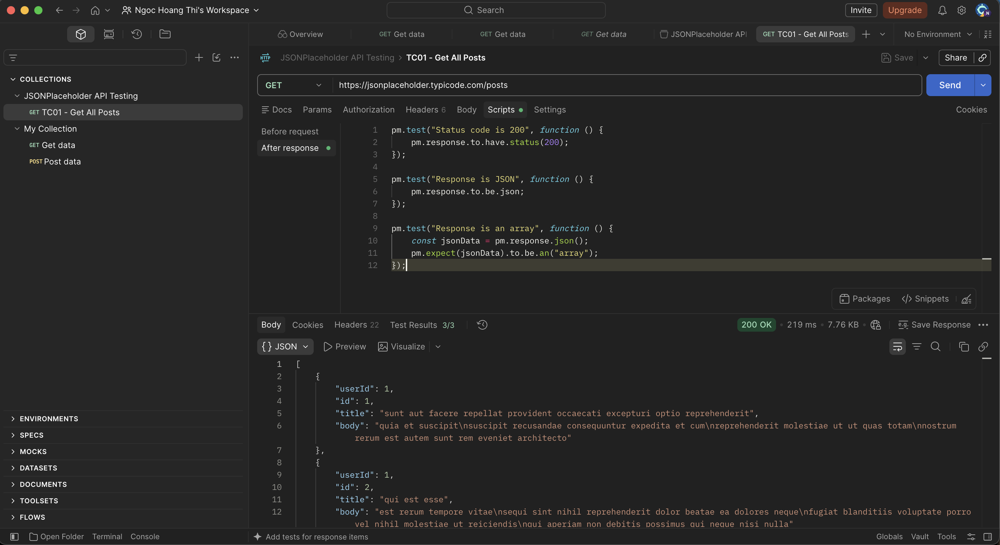
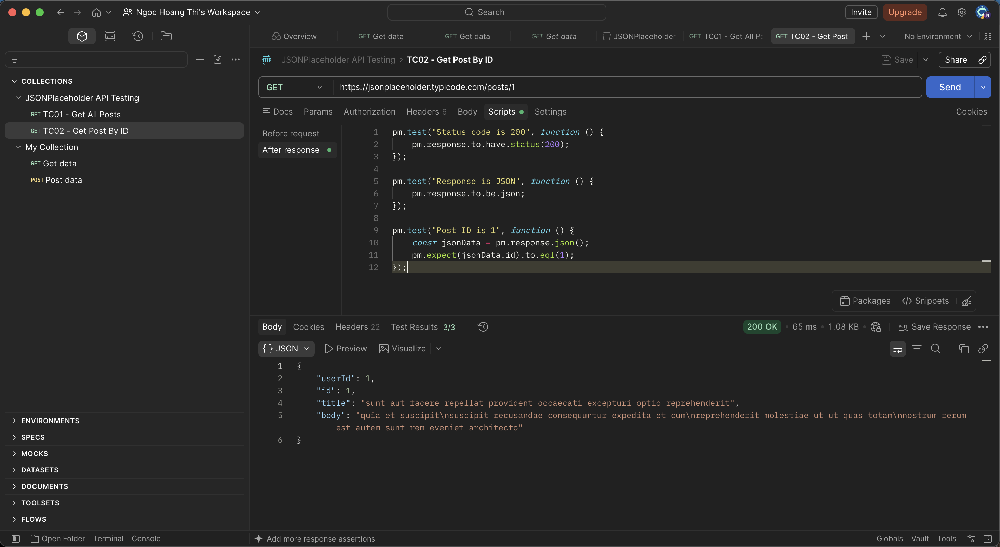
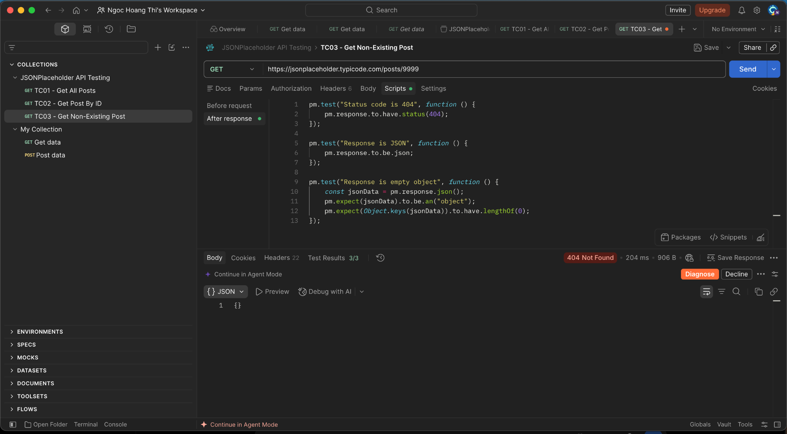
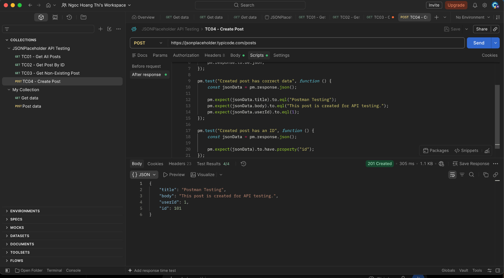
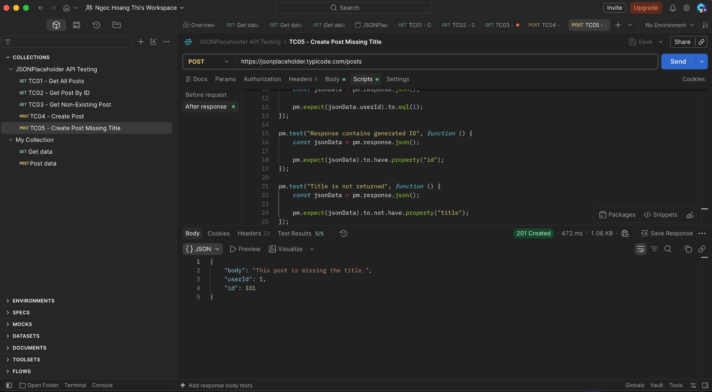
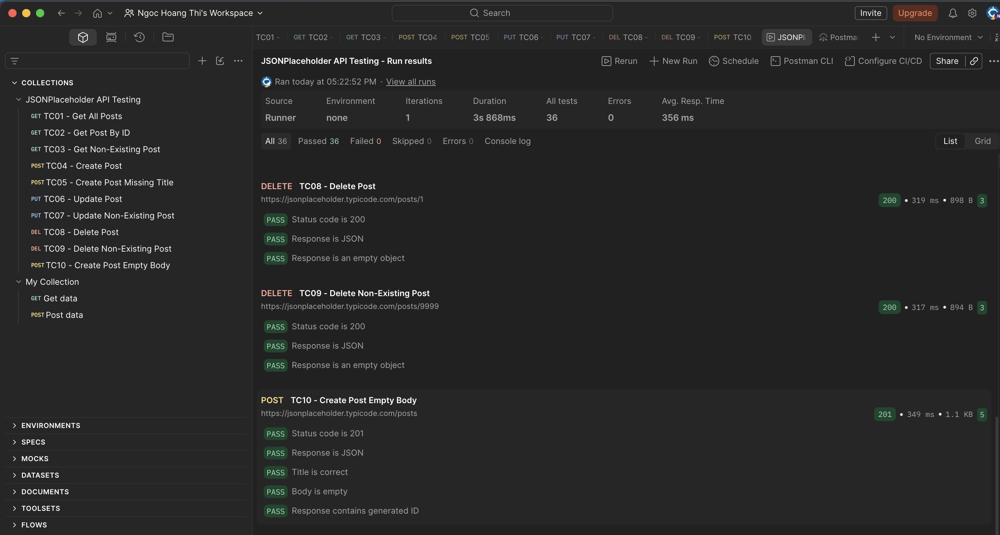

# JSONPlaceholder API Testing with Postman

## 1. Giới thiệu

Bài thực hành này được thực hiện trong môn **Đánh giá và kiểm định chất lượng phần mềm**, với mục tiêu tìm hiểu và áp dụng **Postman** để kiểm thử API.

Trong bài thực hành, API được sử dụng là **JSONPlaceholder** - một REST API giả lập, cung cấp dữ liệu mẫu để thực hành các thao tác HTTP và kiểm thử API.

**API:**

`https://jsonplaceholder.typicode.com`

Các phương thức HTTP được sử dụng:

- `GET`: Lấy dữ liệu
- `POST`: Tạo dữ liệu mới
- `PUT`: Cập nhật dữ liệu
- `DELETE`: Xóa dữ liệu

---

## 2. Mục tiêu

Bài thực hành nhằm đạt được các mục tiêu sau:

- Làm quen với giao diện và cách sử dụng Postman.
- Hiểu cách gửi HTTP Request đến API.
- Thực hành các phương thức `GET`, `POST`, `PUT`, `DELETE`.
- Kiểm tra HTTP Status Code.
- Kiểm tra định dạng và nội dung Response.
- Viết các Test Script trong Postman để tự động kiểm tra kết quả.
- Thực hiện kiểm thử cả trường hợp hợp lệ và không hợp lệ.
- Sử dụng Collection Runner để chạy nhiều Test Case liên tiếp.
- Tổng hợp và đánh giá kết quả kiểm thử API.

---

## 3. Công cụ sử dụng

| Công cụ | Mục đích |
|---|---|
| Postman | Gửi request và thực hiện kiểm thử API |
| JSONPlaceholder | REST API giả lập dùng để kiểm thử |
| GitHub | Lưu trữ Collection và báo cáo |
| Markdown | Viết báo cáo trong `README.md` |

---

## 4. API được sử dụng

### 4.1. Base URL

```text
https://jsonplaceholder.typicode.com
```

### 4.2. Endpoint chính

| Method | Endpoint | Mục đích |
|---|---|---|
| GET | `/posts` | Lấy danh sách bài viết |
| GET | `/posts/1` | Lấy bài viết có ID = 1 |
| GET | `/posts/9999` | Kiểm tra bài viết không tồn tại |
| POST | `/posts` | Tạo bài viết mới |
| PUT | `/posts/1` | Cập nhật bài viết |
| PUT | `/posts/9999` | Cập nhật bài viết không tồn tại |
| DELETE | `/posts/1` | Xóa bài viết |
| DELETE | `/posts/9999` | Xóa bài viết không tồn tại |

---

# 5. Thiết kế Test Case

Bài thực hành gồm **10 Test Case**, bao gồm Positive Test Case, Negative Test Case và Input/Edge Case.

| Test Case | Method | Endpoint | Nội dung kiểm thử | Kết quả |
|---|---|---|---|---|
| TC01 | GET | `/posts` | Lấy tất cả bài viết | PASS |
| TC02 | GET | `/posts/1` | Lấy bài viết theo ID | PASS |
| TC03 | GET | `/posts/9999` | Lấy bài viết không tồn tại | PASS |
| TC04 | POST | `/posts` | Tạo bài viết mới | PASS |
| TC05 | POST | `/posts` | Tạo bài viết thiếu Title | PASS |
| TC06 | PUT | `/posts/1` | Cập nhật bài viết | PASS |
| TC07 | PUT | `/posts/9999` | Cập nhật bài viết không tồn tại | PASS |
| TC08 | DELETE | `/posts/1` | Xóa bài viết | PASS |
| TC09 | DELETE | `/posts/9999` | Xóa bài viết không tồn tại | PASS |
| TC10 | POST | `/posts` | Kiểm tra dữ liệu Body rỗng | PASS |

---

# 6. Chi tiết các Test Case

## TC01 - Get All Posts

### Mục đích

Kiểm tra API có trả về danh sách bài viết hay không.

### Request

```http
GET /posts
```

### Kiểm tra

- HTTP Status Code bằng `200`.
- Response có định dạng JSON.
- Response là một Array.

### Kết quả

**PASS**

### Screenshot



---

## TC02 - Get Post By ID

### Mục đích

Kiểm tra khả năng lấy một bài viết theo ID.

### Request

```http
GET /posts/1
```

### Kiểm tra

- HTTP Status Code bằng `200`.
- Response có định dạng JSON.
- ID của bài viết bằng `1`.

### Kết quả

**PASS**

### Screenshot



---

## TC03 - Get Non-Existing Post

### Mục đích

Kiểm tra trường hợp yêu cầu một bài viết không tồn tại.

### Request

```http
GET /posts/9999
```

### Kiểm tra

- HTTP Status Code bằng `404`.
- Response có định dạng JSON.
- Response là một Object rỗng `{}`.

### Kết quả

**PASS**

### Screenshot



---

## TC04 - Create Post

### Mục đích

Kiểm tra khả năng tạo một bài viết mới bằng phương thức POST.

### Request

```http
POST /posts
```

### Request Body

```json
{
    "title": "Postman Testing",
    "body": "This post is created for API testing.",
    "userId": 1
}
```

### Kiểm tra

- HTTP Status Code bằng `201`.
- Response có định dạng JSON.
- `title` đúng với dữ liệu gửi lên.
- `body` đúng với dữ liệu gửi lên.
- `userId` bằng `1`.
- Response có chứa ID được tạo.

### Kết quả

**PASS**

### Screenshot



---

## TC05 - Create Post Missing Title

### Mục đích

Kiểm tra API khi tạo bài viết nhưng không cung cấp trường `title`.

### Request

```http
POST /posts
```

### Request Body

```json
{
    "body": "This post is missing the title.",
    "userId": 1
}
```

### Kiểm tra

- HTTP Status Code bằng `201`.
- Response có định dạng JSON.
- Response chứa `userId`.
- Response có ID được tạo.
- Response không chứa trường `title`.

### Kết quả

**PASS**

### Nhận xét

JSONPlaceholder là API giả lập nên không thực hiện validation bắt buộc đối với trường `title`. Vì vậy, request vẫn nhận được HTTP Status Code `201`.

Test Case này được sử dụng để kiểm tra và ghi nhận **hành vi thực tế của API khi dữ liệu đầu vào thiếu trường**.

### Screenshot



---

## TC06 - Update Post

### Mục đích

Kiểm tra khả năng cập nhật một bài viết bằng phương thức PUT.

### Request

```http
PUT /posts/1
```

### Request Body

```json
{
    "id": 1,
    "title": "Updated Postman Testing",
    "body": "This post has been updated using PUT.",
    "userId": 1
}
```

### Kiểm tra

- HTTP Status Code bằng `200`.
- Response có định dạng JSON.
- ID vẫn bằng `1`.
- Title được cập nhật chính xác.
- Body được cập nhật chính xác.
- User ID bằng `1`.

### Kết quả

**PASS**

### Screenshot


---

## TC07 - Update Non-Existing Post

### Mục đích

Kiểm tra hành vi của API khi cập nhật một bài viết không tồn tại.

### Request

```http
PUT /posts/9999
```

### Request Body

```json
{
    "id": 9999,
    "title": "Update Non Existing",
    "body": "This post does not exist.",
    "userId": 1
}
```

### Kiểm tra

- HTTP Status Code bằng `500`.
- Response có Content-Type dạng HTML.
- Response chứa thông tin `TypeError`.

### Kết quả

**PASS**

### Nhận xét

API trả về HTTP Status Code `500 Internal Server Error` khi thực hiện cập nhật đối tượng không tồn tại.

Trong bài kiểm thử, kết quả này được xem là **PASS** vì Test Script đã kiểm tra đúng hành vi thực tế của API.

### Screenshot


---

## TC08 - Delete Post

### Mục đích

Kiểm tra khả năng xóa một bài viết.

### Request

```http
DELETE /posts/1
```

### Kiểm tra

- HTTP Status Code bằng `200`.
- Response có định dạng JSON.
- Response là Object rỗng `{}`.

### Kết quả

**PASS**

### Screenshot


---

## TC09 - Delete Non-Existing Post

### Mục đích

Kiểm tra hành vi của API khi xóa một bài viết không tồn tại.

### Request

```http
DELETE /posts/9999
```

### Kiểm tra

- HTTP Status Code bằng `200`.
- Response có định dạng JSON.
- Response là Object rỗng `{}`.

### Kết quả

**PASS**

### Nhận xét

JSONPlaceholder vẫn trả về `200` và Object rỗng khi thực hiện DELETE với ID không tồn tại. Test Case được sử dụng để ghi nhận hành vi thực tế của API.

### Screenshot


---

## TC10 - Create Post Empty Body

### Mục đích

Kiểm tra API với dữ liệu `body` rỗng.

### Request

```http
POST /posts
```

### Request Body

```json
{
    "title": "Post Empty Body",
    "body": "",
    "userId": 1
}
```

### Kiểm tra

- HTTP Status Code bằng `201`.
- Response có định dạng JSON.
- Title đúng với dữ liệu gửi lên.
- Body là chuỗi rỗng.
- Response có ID được tạo.

### Kết quả

**PASS**

### Screenshot


---

# 7. Test Script trong Postman

Để tự động kiểm tra kết quả của API, các Test Script được viết trong phần **Scripts → Post-response** của Postman.

Một số loại kiểm tra được sử dụng:

### 7.1. Kiểm tra HTTP Status Code

```javascript
pm.test("Status code is 200", function () {
    pm.response.to.have.status(200);
});
```

### 7.2. Kiểm tra Response là JSON

```javascript
pm.test("Response is JSON", function () {
    pm.response.to.be.json;
});
```

### 7.3. Kiểm tra dữ liệu trong Response

```javascript
pm.test("Post ID is 1", function () {
    const jsonData = pm.response.json();
    pm.expect(jsonData.id).to.eql(1);
});
```

Thông qua các Test Script, Postman có thể tự động xác định Test Case **PASS hoặc FAIL** dựa trên kết quả thực tế của API.

---

# 8. Kết quả chạy Collection

Sau khi hoàn thành 10 Test Case, toàn bộ Collection được chạy bằng **Postman Collection Runner**.

### Kết quả tổng thể

| Thông số | Kết quả |
|---|---:|
| Requests | 10 |
| Tests | 36 |
| Errors | 0 |
| Kết quả | PASS |

Toàn bộ **36 assertions/tests đều PASS** và không có lỗi khi chạy Collection.

### Screenshot kết quả tổng thể



---

# 9. Tổng hợp kết quả kiểm thử

| Nhóm | Số lượng |
|---|---:|
| Tổng số Test Case | 10 |
| Positive Test Case | 5 |
| Negative Test Case | 3 |
| Input / Edge Case | 2 |
| Tổng số Tests/Assertions | 36 |
| Tests PASS | 36 |
| Tests FAIL | 0 |
| Errors | 0 |

Các Test Case đã bao phủ các phương thức HTTP chính:

- `GET`
- `POST`
- `PUT`
- `DELETE`

Đồng thời kiểm tra:

- Trường hợp dữ liệu hợp lệ.
- Dữ liệu không tồn tại.
- Dữ liệu thiếu trường.
- Dữ liệu rỗng.
- Hành vi của API khi xảy ra lỗi.

---

# 10. Cấu trúc Repository

Repository được tổ chức như sau:

```text
jsonplaceholder-postman-testing/
│
├── JSONPlaceholder API Testing.postman_collection.json
│
├── screenshots/
│   ├── TC01-get-all-posts.png
│   ├── TC02-get-post-by-id.png
│   ├── TC03-get-non-existing-post.png
│   ├── TC04-create-post.png
│   ├── TC05-create-post-missing-title.png
│   ├── TC06 - Update Post.png
│   ├── TC07 - Update Non-Existing Post.png
│   ├── TC08 - Delete Post.png
│   ├── TC09 - Delete Non-Existing Post.png
│   ├── TC10 - Create Post Empty Body.png
│   └── tong.png
│
└── README.md
```

Trong đó:

- `JSONPlaceholder API Testing.postman_collection.json`: Collection được export từ Postman.
- `screenshots/`: Chứa hình ảnh minh họa kết quả kiểm thử.
- `tong.png`: Ảnh tổng hợp kết quả chạy Collection.
- `README.md`: Báo cáo của bài thực hành.

---

# 11. Cách chạy lại Collection

## Bước 1: Clone Repository

```bash
git clone https://github.com/Hoangthingoc216/jsonplaceholder-postman-testing.git
```

Di chuyển vào thư mục:

```bash
cd jsonplaceholder-postman-testing
```

## Bước 2: Mở Postman

Mở ứng dụng Postman trên máy tính.

## Bước 3: Import Collection

Trong Postman, chọn:

```text
Import
→ File
→ JSONPlaceholder API Testing.postman_collection.json
```

## Bước 4: Chạy Collection

Trong Postman:

```text
Collections
→ JSONPlaceholder API Testing
→ Run
```

Sau đó chọn **Run Collection** để thực hiện toàn bộ Test Case.

Kết quả mong đợi:

```text
10 requests
36 tests
0 errors
```

---

# 12. Kết luận

Thông qua bài thực hành, em đã làm quen với quy trình kiểm thử REST API bằng Postman.

Bài thực hành đã thực hiện kiểm thử 10 Test Case với các phương thức HTTP `GET`, `POST`, `PUT` và `DELETE`. Các Test Script được xây dựng để tự động kiểm tra HTTP Status Code, định dạng Response và dữ liệu trả về.

Kết quả chạy Collection cho thấy:

- 10 Requests được thực hiện.
- 36 Tests/Assertions được kiểm tra.
- 36 Tests đều PASS.
- Không có Errors.

Qua bài thực hành, em hiểu được cách xây dựng Test Case, gửi Request, kiểm tra Response và sử dụng Postman Collection Runner để hỗ trợ tự động hóa quá trình kiểm thử API.

---

# 13. Repository

**GitHub Repository:**

https://github.com/Hoangthingoc216/jsonplaceholder-postman-testing